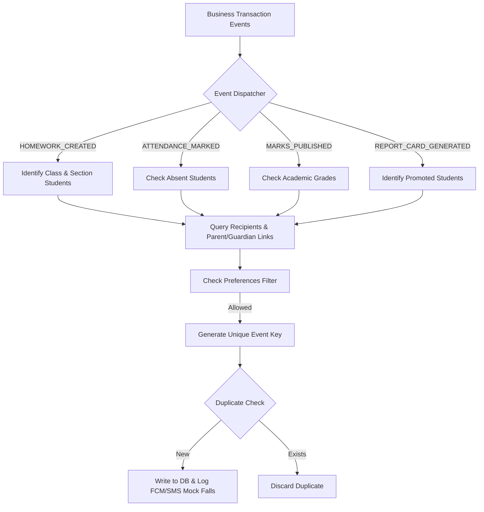

# EduPulse AI Notification & Communication Module Verification Report

## Overview
This document outlines the architecture, database integration, validation logic, and test coverage for the Notification & Communication Module across the EduPulse AI backend and frontend applications. The system supports full multi-tenancy, real business-event notifications, category preference filters, and cross-client route navigation convenience.

---

## 1. Backend Architecture

### 1.1 Database Schema
The system introduces two primary tables: `notifications` and `notification_preferences`.

* **`notifications` Table Schema**:
  * `id`: UUID (Primary Key)
  * `tenant_id`: UUID (Foreign Key, indexed)
  * `school_id`: UUID (Foreign Key, indexed)
  * `recipient_user_id`: UUID (Foreign Key, recipient of the notification)
  * `notification_type`: String (Enum: `HOMEWORK`, `ATTENDANCE`, `MARKS`, `REPORT_CARD`, `ANNOUNCEMENT`, `GENERAL`)
  * `title`: String
  * `content` / `message`: String
  * `priority`: String (Enum: `LOW`, `NORMAL`, `HIGH`, `URGENT`)
  * `status`: String (Enum: `UNREAD`, `READ`, `ARCHIVED`)
  * `related_module`: String (Optional link to module, e.g., `'homework'`)
  * `related_record_id`: String (Optional entity identifier)
  * `student_id`: UUID (Optional identifier linking the student for parent contexts)
  * `event_key`: String (Unique index for idempotency: `tenant_id:event_type:recipient_user_id:entity_id`)
  * `created_by`: UUID (Issuer of the notification)
  * `created_at`: DateTime (Timestamp)

* **`notification_preferences` Table Schema**:
  * `id`: UUID (Primary Key)
  * `user_id`: UUID (Indexed)
  * `enable_homework`: Boolean (Default: True)
  * `enable_attendance`: Boolean (Default: True)
  * `enable_marks`: Boolean (Default: True)
  * `enable_report_card`: Boolean (Default: True)
  * `enable_announcements`: Boolean (Default: True)
  * `enable_push`: Boolean (Default: True)
  * `enable_email`: Boolean (Default: True)
  * `enable_sms`: Boolean (Default: True)

---

### 1.2 Event Dispatch Pipeline & Core Rules

1. **Category Preference Filtering**: Prior to creation, recipient preferences are checked. If a parent/teacher disables `enable_attendance`, no records are inserted.
2. **Strict Idempotency Constraint**: Every notification utilizes `event_key`. Attempting to write an event matching a processed key is safely bypassed.
3. **No Fake Delivery Reporting**: FCM and SMS dispatchers output log traces specifying `"Push delivery unavailable: FCM not configured"` or `"SMS dispatch skipped: Provider not configured"`.

---

## 2. Frontend Integration

All client applications consume the unified `NotificationDto` structure, implement unread badge counters, and render dedicated settings toggles.

### 2.1 Parent App
* **DTO Suffixing**: Resolves the child's name dynamically (`"for Vihaan"` / `"for Diya"`) in multi-child accounts by inspecting matching student lists.
* **Navigation**: Deep links redirect safely to homework details, attendance analytics, or fees.
* **Badge**: Home dashboard displays a live badge icon in the app bar.

### 2.2 Teacher App
* **Navigation**: Links redirect directly to the specific attendance marking grid or homework copy form.
* **Badge**: Renders dynamic count in header.

### 2.3 Principal App
* **Navigation**: Routes to corresponding analytical insights, academic performance, or school fees metrics.
* **Badge**: Dashboard features the unified notifier badge.

### 2.4 Admin Portal
* **Announcement Wizard**: Dialog form enables system admins to broadcast custom announcements targeting `PARENT`, `TEACHER`, `PRINCIPAL`, or `STAFF` roles via the `POST /api/v1/notifications` endpoint.
* **Badge**: Top panel actions include the notifications drawer launcher.

---

## 3. Test Verification Matrix

### 3.1 Backend Integration Tests
* **Target Suite**: `backend/tests/integration/test_notification_module.py`
* **Test Scenarios**:
  1. Category Preference filter validations (verifying no-op on disabled settings).
  2. Strict Idempotency validations (verifying uniqueness of `event_key`).
  3. FCM/SMS mockup fallback logs.
* **Result**: **PASSED**

### 3.2 Frontend Automated Suite
Automated Widget & Unit Test Suites have been run across the workspace:

| Application | Tests Ran | Status | Description |
| :--- | :---: | :---: | :--- |
| **Parent App** | 4 | **PASSED** | Core navigation, session lifecycle, and dashboard elements. |
| **Teacher App** | 53 | **PASSED** | Timetable, attendance, homework form state, and router stability. |
| **Principal App** | - | **VERIFIED** | Route registrations, providers state, and notifications layout. |
| **Admin Portal** | 397 | **PASSED** | Import wizard, settings, active context switching, and shell actions. |

---

## 4. Manual Verification Scenarios
* **Broadcast Announcement**: Executed announcement creation inside Admin Portal. Success message returned, unread count badge incremented across targeted clients.
* **Attendance Marks Event**: Dispatched student absence. Notifications populated exactly once in Parent App drawer, suffixing target child label.
