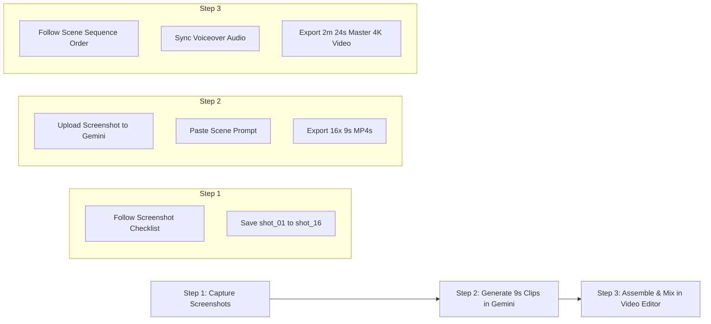

# EduPulse AI — Product Demo Video Production Guide

Welcome to the **EduPulse AI Product Demo Video Production Package**. This directory contains the complete specification, storyboard, AI generative prompts, professional voiceover script, screenshot capture checklist, and master sequencing plan for producing a high-impact, 2-to-3 minute video demonstration of EduPulse AI using the **actual application screens and workflows**.

---

## Master Production Reference Matrix

Use this quick-reference table to execute each step of the production pipeline from screenshot capture to Gemini AI Video generation:

| Scene # | Scene Title | Screenshot to Capture (URL / Route) | Screenshot File for Gemini | Prompt ID (in `edupulse_video_prompts.md`) | Duration | Voiceover Script | Final Scene Order |
|:---|:---|:---|:---|:---|:---|:---|:---|
| **01** | The Problem | Staged office desk with paper registers & spreadsheets | `shot_01_problem_fragmentation.png` | `PROMPT_SCENE_01_THE_PROBLEM` | 9 sec | *"Schools need more than separate applications. They need one connected operating system."* | Clip 01 (0:00 - 0:09) |
| **02** | EduPulse AI | Admin Portal Login (`/login`) & Brand Emblem | `shot_02_edupulse_brand_login.png` | `PROMPT_SCENE_02_EDUPULSE_BRAND_LOGIN` | 9 sec | *"Meet EduPulse AI: a connected digital operating system designed for modern schools."* | Clip 02 (0:09 - 0:18) |
| **03** | School Onboarding | School Onboarding Center (`/school-onboarding`) | `shot_03_school_onboarding.png` | `PROMPT_SCENE_03_SCHOOL_ONBOARDING` | 9 sec | *"Create a school in minutes, and progressively configure classes, staff, and students as the institution grows."* | Clip 03 (0:18 - 0:27) |
| **04** | School Command Center | Admin Dashboard (`/dashboard`) | `shot_04_admin_dashboard.png` | `PROMPT_SCENE_04_SCHOOL_COMMAND_CENTER` | 9 sec | *"School administrators get a single, real-time command center for daily campus operations."* | Clip 04 (0:27 - 0:36) |
| **05** | Student 360 Folio | Student 360 Modal (`Student360Modal` / `/students`) | `shot_05_student_360_modal.png` | `PROMPT_SCENE_05_STUDENT_360_FOLIO` | 9 sec | *"Student 360 brings each student's academic progress, attendance records, financial status, and family information together."* | Clip 05 (0:36 - 0:45) |
| **06** | Teachers & Staff | Teachers & Staff Directory (`/teachers`) | `shot_06_teachers_staff.png` | `PROMPT_SCENE_06_TEACHERS_AND_STAFF` | 9 sec | *"Manage your complete faculty and staff ecosystem from one place, with clear department and role assignments."* | Clip 06 (0:45 - 0:54) |
| **07** | Attendance & Geofencing | Teacher App Staff Attendance (`/staff-attendance`) | `shot_07_staff_attendance_geofence.png` | `PROMPT_SCENE_07_ATTENDANCE_AND_GEOFENCING` | 9 sec | *"Attendance can use the school's configured location boundary to verify where staff check in."* | Clip 07 (0:54 - 1:03) |
| **08** | School Planner | Planner Calendar (`/planner/calendar`) | `shot_08_school_planner.png` | `PROMPT_SCENE_08_SCHOOL_PLANNER` | 9 sec | *"School Planner becomes the operational coordination center for exams, circulars, schedules, and leave approvals."* | Clip 08 (1:03 - 1:12) |
| **09** | Fees & Finance | Fees Dashboard & Ledgers (`/fees`, `/fees/ledger`) | `shot_09_fees_management.png` | `PROMPT_SCENE_09_FEES_AND_FINANCE` | 9 sec | *"From fee assignment to payments and receipts, financial operations stay accurate, connected, and clear."* | Clip 09 (1:12 - 1:21) |
| **10** | Payroll & Expenses | Staff Salaries & Expenses (`/fees/salaries`, `/fees/expenses`) | `shot_10_payroll_expenses.png` | `PROMPT_SCENE_10_PAYROLL_AND_EXPENSES` | 9 sec | *"Track institutional expenses and manage staff payroll with transparent calculations and verified payment records."* | Clip 10 (1:21 - 1:30) |
| **11** | Imports Wizard | Bulk Import Screen (`/bulk-import`) | `shot_11_imports_wizard.png` | `PROMPT_SCENE_11_DATA_IMPORTS_WIZARD` | 9 sec | *"Bring existing school data into EduPulse through flexible, validated CSV and Excel imports."* | Clip 11 (1:30 - 1:39) |
| **12** | Reports & Analytics | Reports Dashboard (`/reports`) | `shot_12_reports_analytics.png` | `PROMPT_SCENE_12_REPORTS_AND_ANALYTICS` | 9 sec | *"Turn everyday school operations into meaningful insights for better, data-driven decision-making."* | Clip 12 (1:39 - 1:48) |
| **13** | Teacher Mobile App | Teacher App Home (`/home`) | `shot_13_teacher_app.png` | `PROMPT_SCENE_13_TEACHER_MOBILE_APP` | 9 sec | *"Teachers get the tools they need directly on their phones: timetables, attendance, homework, and marks."* | Clip 13 (1:48 - 1:57) |
| **14** | Parent Mobile App | Parent App Dashboard (`/dashboard`) | `shot_14_parent_app.png` | `PROMPT_SCENE_14_PARENT_MOBILE_APP` | 9 sec | *"Parents stay connected with their children's school journey, from real-time attendance to instant digital fee payments."* | Clip 14 (1:57 - 2:06) |
| **15** | Unified Ecosystem | Multi-Device Composite (Admin, Principal, Teacher, Parent) | `shot_15_connected_ecosystem.png` | `PROMPT_SCENE_15_UNIFIED_ECOSYSTEM` | 9 sec | *"One unified platform. Multiple dedicated roles. One seamlessly connected school ecosystem."* | Clip 15 (2:06 - 2:15) |
| **16** | Finale & Brand Vision | EduPulse AI Vector Logo (`packages/edupulse_assets/...`) | `shot_16_edupulse_finale_logo.png` | `PROMPT_SCENE_16_FINALE_AND_VISION` | 9 sec | *"EduPulse AI. The intelligent operating system for modern schools."* | Clip 16 (2:15 - 2:24) |

---

## Complete Package Documentation Map

1. **[Storyboard (`edupulse_video_storyboard.md`)](file:///d:/EDU_PULSE_AI/docs/video/edupulse_video_storyboard.md)**:
   - Full 16-scene breakdown covering visual narrative, on-screen text, camera movements, sound design, and micro-interactions.
2. **[Gemini Video Prompts (`edupulse_video_prompts.md`)](file:///d:/EDU_PULSE_AI/docs/video/edupulse_video_prompts.md)**:
   - Ready-to-use prompts for Gemini AI Video / Veo 2 with strict UI preservation instructions, negative prompts, and camera choreography.
3. **[Voiceover Script (`edupulse_voiceover.md`)](file:///d:/EDU_PULSE_AI/docs/video/edupulse_voiceover.md)**:
   - Complete spoken voiceover script timed to each scene, including pronunciation keys, cadence benchmarks (130–140 WPM), and vocal tone directions.
4. **[Screenshot Checklist (`edupulse_screenshot_checklist.md`)](file:///d:/EDU_PULSE_AI/docs/video/edupulse_screenshot_checklist.md)**:
   - Technical operator checklist specifying URLs, routes, test accounts, viewport resolutions (`1920 × 1080` and `1080 × 2400`), and required mock data.
5. **[Scene Sequence Order (`edupulse_video_scene_order.md`)](file:///d:/EDU_PULSE_AI/docs/video/edupulse_video_scene_order.md)**:
   - Video editor assembly timeline (0:00 to 2:24), audio stem mixing specs, BGM tempo recommendations (115 BPM), and transition guidelines.

---

## 3-Step Production Workflow

### Step 1: Capture Real Screenshots
- Run the Flutter apps locally in Chrome or mobile simulator.
- Use the checklist in `edupulse_screenshot_checklist.md` to capture each required state at clean 1:1 pixel scaling.
- Save each image with its exact designated filename (`shot_01_...` through `shot_16_...`).

### Step 2: Generate 9-Second Video Clips in Gemini
- Open Gemini AI Video / Veo 2.
- Upload the designated screenshot for the scene as the image reference.
- Copy the matching prompt from `edupulse_video_prompts.md`.
- Generate the clip at 16:9 landscape (9.0 seconds).
- Review and verify that the interface is preserved accurately with crystal-clear text and zero UI hallucinations.

### Step 3: Final Assembly & Sound Mixing
- Import all 16 generated MP4 clips into your video editor (DaVinci Resolve, Premiere Pro, or Final Cut).
- Order them from `clip_01` to `clip_16` using the timeline in `edupulse_video_scene_order.md`.
- Layer the professional voiceover track from `edupulse_voiceover.md`.
- Add an ambient tech background track (115 BPM) with -16dB ducking during voice lines.
- Export your final, broadcast-ready product demonstration video!
