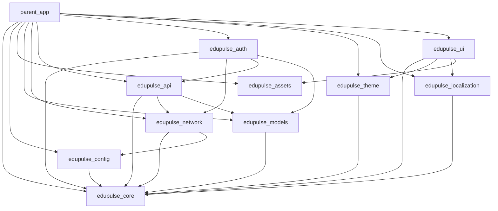

# EduPulse AI Client Architecture

This document details the architectural boundaries and software engineering guidelines for the **EduPulse AI** client application suite.

---

## Architectural Philosophy

We follow **Strict Clean Architecture** combined with a **Feature-First** structure. The main goals are modularity, testability, and maintainability.

```
       +-----------------------------------------------------------+
       |                     Presentation Layer                     |
       |  (UI Widgets, Pages, Riverpod Providers, Controllers)     |
       +-----------------------------+-----------------------------+
                                     |
                                     v (Uses Use Cases & Entities)
       +-----------------------------------------------------------+
       |                        Domain Layer                       |
       |   (Usecases, Entities, Repository Interfaces - PURE DART) |
       +-----------------------------+-----------------------------+
                                     ^
                                     | (Implements Repository Interface)
       +-----------------------------+-----------------------------+
       |                         Data Layer                        |
       |  (Repo Implementations, Datasources, DTOs, API Mappers)   |
       +-----------------------------------------------------------+
```

### 1. Presentation Layer
- Contains Flutter UI layouts, reusable widgets, navigation flow, and Riverpod providers.
- **Rules**:
  - Zero raw business logic inside UI Widgets.
  - Presentation must *never* reference network packages (e.g. `Dio`), raw database components, or network DTO schemas directly.
  - Rebuilds must be optimized using `const` constructors.

### 2. Domain Layer
- Contains Use Cases, Entities, and Repository Interfaces.
- Written in **pure Dart**.
- **Rules**:
  - **No Flutter imports**. It must be plain Dart code.
  - Represents the core business logic of the app.
  - Independent of databases, APIs, or UI frameworks.

### 3. Data Layer
- Contains Repository Implementations, Remote/Local Data Sources, API Mappers (which map API DTOs to Domain Entities), and Model classes.
- **Rules**:
  - Translates data between the network layer/databases and the Domain layer.
  - Implements the Repository interfaces defined in the Domain layer.

---

## Package Boundary Map

To support code reuse across multiple apps (Parent, Teacher, Principal, Admin), the client codebase is split into the following packages:



---

## State Management Rules

- **Riverpod** is the ONLY permitted state management framework.
- Always use `Notifier` or `AsyncNotifier` (or their autoDispose versions) for state management.
- **NEVER** use:
  - `setState` for business logic (only local UI state like toggles or controllers).
  - Bloc, Cubit, GetX, MobX, or vanilla ChangeNotifier.
- Leverage `AsyncValue` to handle asynchronous actions, exposing loading, success, and error states cleanly.
